# APLICACIÓN DISTRIBUIDA SEGURA EN TODOS SUS FRENTES
A continuación, se desarrollará una aplicación web distribuida, cumpliendo con los requerimientos de seguridad que serán mencionados a detalle en la sección  de _Decisiones de diseño_.


## Autor
* **Juan Felipe Sánchez Pérez**

## Instalación y ejecución
### Prerequisitos

* Versión de Java: 17.
* La virtualización se hizo a través de una Mac con chip M1, por lo que para poder utilizar las imágenes que se darán a continuación en una instancia de EC2, debido a la arquitectura `linux/arm64/v8` usada, debería crearse una instancia con una arquitectura de 64 bits (Arm) para que funcionen. Para el caso de Windows, saldrá una advertencia pero las imágenes podrán utilizarse.  

### Instalación y uso
En este apartado observará cómo ejecutar en su máquina local la aplicación. Si desea ver cómo se realizó la implementación en instancias EC2 de AWS, diríjase a la sección _Despliegue_.  
1. Inicie Docker. Luego, abra la consola o la línea de comandos y ejecute el siguiente comando para crear una red de Docker, donde se conectarán los contenedores que se creen para que puedan interactuar entre sí:  
```
docker network create my_network
```  

2. Una vez creada la red, use el siguiente comando para crear un contenedor que tendrá la imagen de mongo, y se conecte a la red anteriormente especificada:
```
docker run -d --network=my_network -p 27017:27017 --name db mongo
```  

3. Ahora, cree los siguientes contenedores para probar la aplicación:    
Contenedor para el servicio expuesto por el servidor `LoginServer`, que se encarga de realizar el proceso de inicio de sesión del usuario, comprobando que es un usuario registrado en la base de datos:    
```
docker run -d --network=my_network -p 35001:46001 --name loginservice juansanxz/loginservice  
```  

Contenedor para el servicio expuesto por el servidor `PalindromeServer`, al que se accede luego de la autenticación del usuario, y que permite determinar si una cadena es o no un palíndromo:  
```
docker run -d --network=my_network -p 35002:46002 --name palindromeservice juansanxz/palindromeservice
```  
 
Contenedor cuyo único fin es insertar en la base de datos al usuario con el que se debe ingresar de forma satisfactoria para la prueba:  
```
docker run -d --network=my_network -p 35003:46003 --name addusercontainer juansanxz/adduserservice  
```  

Contenedor para el servicio fachada `ServerFacade`, que es el que interactúa con el cliente, y con los servidores `LoginServer` y `PalindromeServer`:   
```
docker run -d --network=my_network -p 35000:46000 --name serverfacade juansanxz/serverfacade   
```  

4. Una vez creados los contenedores con las imágenes de docker hub, se obeservará en docker algo similar:  
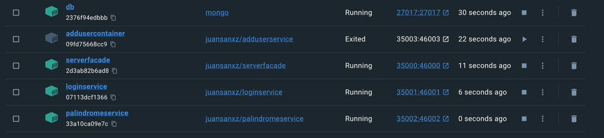  

5. Si intenta ingresar a la URL `http://localhost:35000/login.html`, no podrá acceder al servicio, porque en esta aplicación se está usando el protocolo _HTTPS_.  
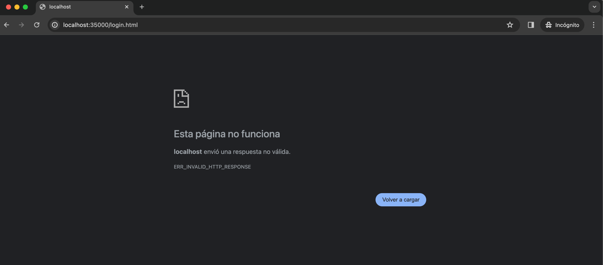  

6. Ahora, si ingresa a la URL `https://localhost:35000/login.html`, podrá comprobar el correcto funcionamiento de la aplicación, usando certificados que garantizan la integridad de los datos y la autenticación del origen de la solicitud:  
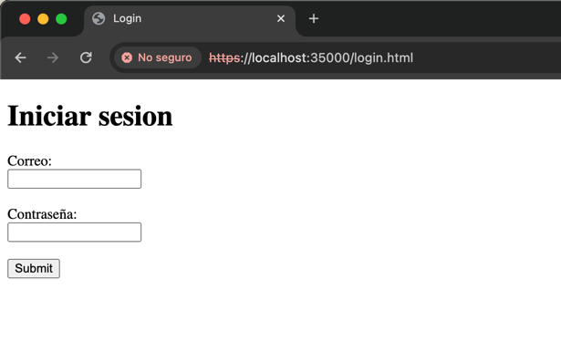  

7. Intente acceder al servicio. Las únicas credenciales permitidas para hacerlo son las siguientes:  
Correo: `juansan@mail.com`  
Contraseña: `juan123`  
Al ingresarlas, será redirigido al servicio para determinar si una cadena es un palíndromo:  
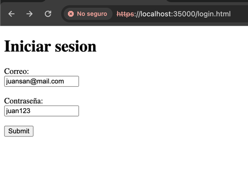  
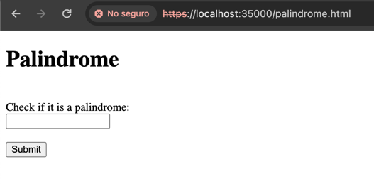  

Si intenta usar otras credenciales, se le notificará que no son correctas y no podrá acceder al servicio:  
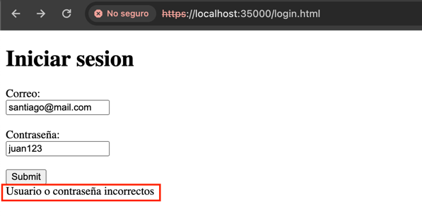  

8. Use el servicio que determina si una cadena es o no un palíndromo:  
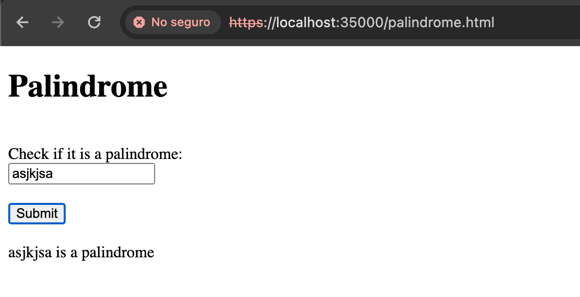  

## Decisiones de diseño
La arquitectura implementada fue la siguiente:  
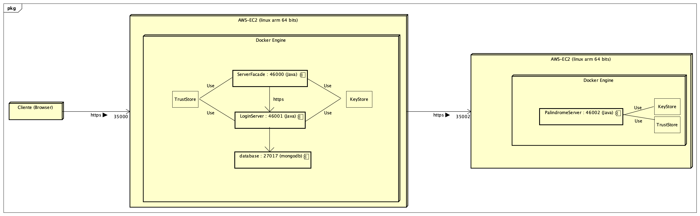

Esta arquitectura atiende los requerimientos solicitados en el enunciado:  
1. __Debe permitir un acceso seguro desde el browser a la aplicación. Es decir debe garantizar autenticación, autorización e integridad de usuarios.__
   1. Para ello, se hace uso de certificados, generados con _KeyTool_, que permiten autenticar a los principales y autorizarlos para que hagan uso del servicio. Además, se implementó un servidor encargado de validar el inicio de sesión, el cual emplea una función hash que usa el algoritmo _SHA-256_ para almacenar las contraseñas de forma segura. 
2. __Debe tener al menos dos computadores comunicandose entre ellos y el acceso de servicios remotos debe garantizar: autenticación, autorización e integridad entre los servicios. Nadie puede invocar los servicios si no está autorizado.__
   1. En la arquitectura, se utilizaron dos instancias EC2 de AWS, para cumplir con este requerimiento. La primera, contiene tres contenedores: Uno que ejecuta al servidor fachada `ServerFacade`, otro que ejecuta al servidor `LoginServer` que se encarga del inicio de sesión, y el último que ejecuta la base de datos. La segunda instancia de EC2, contiene un contenedor que ejecuta el servicio para determinar si una cadena es o no un palíndromo `PalindromeServer`. Entre las dos instancias se establece una comunicación segura, uilizando el protocolo https.
   2. Se hace uso de la clase `SecureURLReader.java` para realizar las solicitudes usando el _TrustStore_ que se defina, haciendo que la comunicación sea segura entre las dos instancias de EC2.
   
3. __Para poder escalar la arquitectura e incorporar nuevos servicios, manteniendo la seguridad del sistema, podría hacerse lo siguiente:__  
   1. Crear una clase específica que se encargue de ofrecer el nuevo servicio. Un ejemplo de ello es `PalindromeServer`. 
   2. Una vez se tenga definido el servicio que se va a exponer, se generan un par de llaves públicas y privadas, y un certificado, almacenando esto en un archivo protegido. Para ello, se usa el siguiente comando:  
   ```
      keytool -genkeypair -alias ecikeypairnewservice -keyalg RSA -keysize 2048 -storetype PKCS12 -keystore ecikeystorenewservice.p12 -validity 3650
   ```
   3. Posteriormente, se importa el certificado a un archivo, para luego ser exportado a el TrustStore que se tiene definido. En este caso, es _myTrustStore.p12_.  Use los siguientes comandos para realizarlo:  
   ```
      keytool -export -keystore ./ecikeystorenewservice.p12 -alias ecikeypairnewservice -file ecicertnewservice.cer
   ```  
   ```
      keytool -import -file ./ecicertnewservice.cer -alias firstCAnewservice -keystore myTrustStore.p12
   ```
   4. Luego, agregue la siguiente línea en el método main de la clase que creó y que expone el servicio, para habilitar la comunicación segura, usando el certificado creado anteriormente, y la clave con la que se creó:  
   ```
      secure("certificados/ecikeystorenewservice.p12", "123456", null, null);
   ```  
   5. Finalmente, cómo se está estableciendo la comunicación con los servicios a partir de la fachada `ServerFacade`, desde esta clase se realiza la petición al método estático `invokeService()` de la clase `SecureURLReader`, enviando de parámetros la URL, el _TrustStore_ y la contraseña del mismo. Este método realiza la petición de forma segura al servicio específico que configuró y desea exponer. De esta forma, se sigue con el principio de responsabilidad única, en un sistema modular que permite el escalamiento de servicios.

## Despliegue
Para realizar el despliegue, se crearon dos instancias de EC2 en AWS  con la imagen del sistema operativo Linux y con una arquitectura de 64 bits (Arm):   
1. En la primera se crearon cuatro contenedores (el contenedor `addusercontainer`no se indicó en la arquitectura, porque se usa sólo para poblar la base de datos con un usuario):  
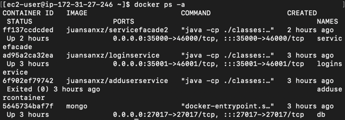  

2. En la segunda, se creó uno solamente, que corresponde al que ejecuta el `PalindromeServer.java`:   
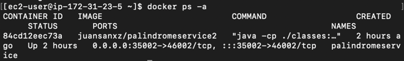  

Luego, se agrega una regla de entrada en el grupo de seguridad de la primera instancia de EC2 para permitir el tráfico por el puerto _35000_, y otra en la segunda instancia para permitir el tráfico por el puerto _35002_, que será usado para comuicar las máquinas. Una vez hecho esto, se ingresa a la URL compuesta por el dominio de la primera instancia de EC2 (que contiene al servidor fachada) y el puerto indicado anteriormente, junto al recurso que se desea solicitar; comprobando el funcionamiento adecuado del despliegue:  
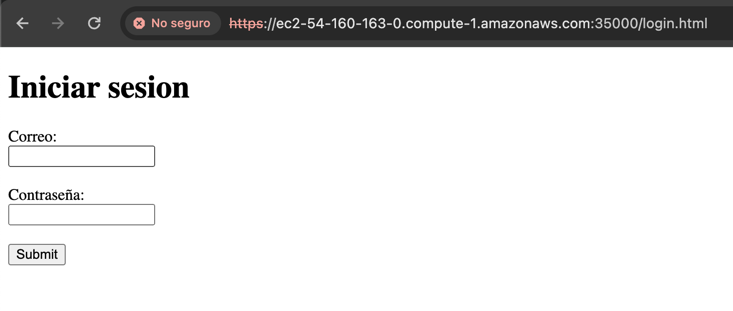  

En el siguiente video, se observa el despliegue realizado de forma exitosa, estableciendo una comunicación segura tanto desde el browser a la aplicación, como entre las instancias de EC2 que consumen servicios entre sí dentro de la arquitectura diseñada.  
Primero, se observa la conexión correspondiente a cada instacia de EC2. En la terminal de la izquierda se muestra la creación de el contenedor del servicio fachada, y se muestran los contenedores que estan ejecutándose. En la terminal ubicada al lado derecho, se crea el contenedor correspondiente para el servicio que determina si una cadena es un palíndromo, tal como se muestra en la arquitectura definida en la sección _Decisiones de diseño_, y se evidencia que es el único contenedor que se ha creado en esa máquina virtual de AWS.  
Posteriormente, se accede al servicio fachada a través de una de las instancias de EC2, y se intenta acceder con una credenciales incorrectas. Una vez se ponen los datos de un usuario registrado, se da acceso al siguiente servicio. En este caso, se escribieron dos cadenas distintas, y luego se consultan los logs de los contenedores que exponen el servicio fachada y palíndromo respectivamente, y se identifica que se comunicaron las dos máquinas virtuales de forma segura para responder la solicitud hecha desde el browser.

https://youtu.be/eYg8BYTBsr0


## Build
* Maven - Administración de dependencias

## Versión
1.0

